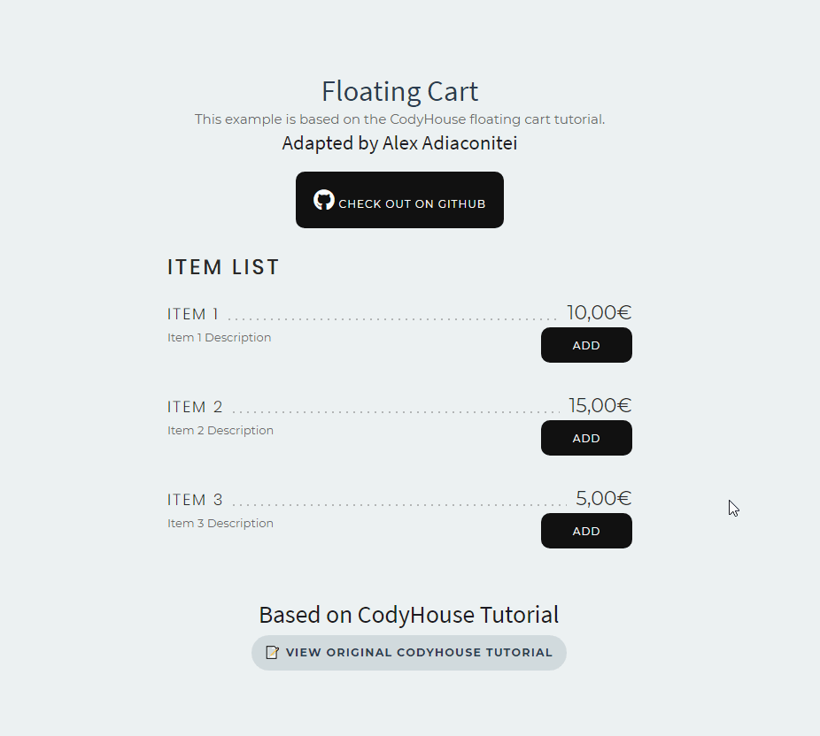

# floating-cart-html-js
This is an example based on the [CodyHouse](https://codyhouse.co/gem/add-to-cart-interaction) floating cart tutorial. It has been modified to work with a simple list of items.

## Features ✔️
- Given a list of items with the right properties (check html) when adding one to the cart, it is displayed with its price and name.
- If an item has already been added to the cart and the user tries to add it again, then its quantity will be increased by 1.
- The total price is automatically calculated.
- The "delete" action can be undone before 8 seconds since it was clicked.

## Known issues ❌
- Maximum quantity for a given item is 10 (because of how it is defined in the html of the select)
- After deleting an item fromt he cart and undo the action, when adding the same item from the list it is added as a new item instead of increasing quantity (probably because of the id given)
